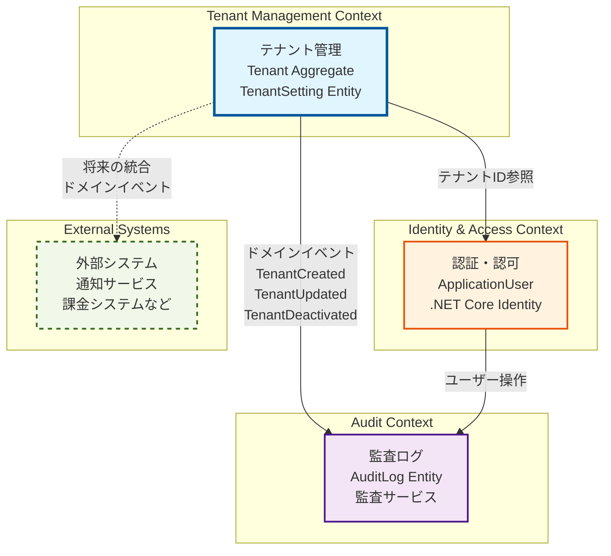
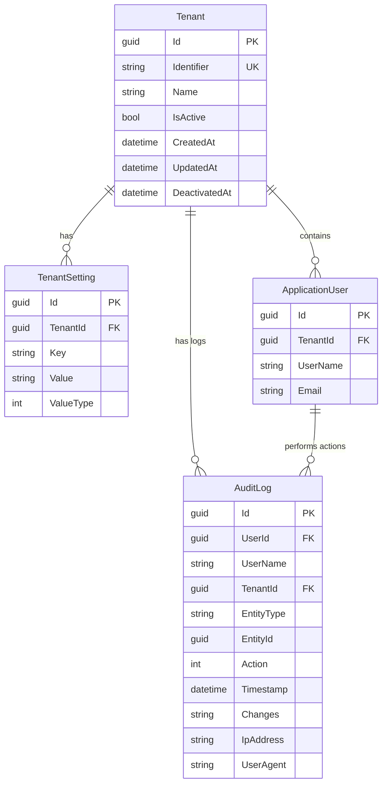

# Design Document: Tenant Management Backend

## Overview

本設計ドキュメントは、マルチテナント対応業務アプリケーションのバックエンドにおけるテナント管理機能の技術設計を定義します。ドメイン駆動設計（DDD）の原則に基づき、テナントの完全なライフサイクル管理とデータ分離を実現します。

### 設計目標

1. **データ分離の保証**: テナント間のデータを完全に分離し、セキュリティとプライバシーを確保
2. **スケーラビリティ**: 10,000テナントまでスケール可能なアーキテクチャ
3. **拡張性**: 複数のテナント識別戦略をサポート（サブドメイン、ヘッダー、JWT）
4. **保守性**: DDDパターンによる明確な責務分離と疎結合

### 技術スタック

- **言語**: C# 12
- **フレームワーク**: .NET 8
- **認証**: ASP.NET Core Identity
- **ORM**: Entity Framework Core 8
- **データベース**: SQL Server（または任意のEF Core対応RDBMS）

## Architecture

### 境界コンテキスト（Bounded Context）

本システムは、DDDの戦略的設計に基づき、以下の境界コンテキストで構成されます：



#### 境界コンテキストの説明

**1. Tenant Management Context（テナント管理コンテキスト）**
- **責務**: テナントのライフサイクル管理、テナント設定管理、データ分離
- **集約**: Tenant（集約ルート）、TenantSetting
- **バリューオブジェクト**: TenantIdentifier
- **ドメインサービス**: TenantService
- **リポジトリ**: ITenantRepository
- **ドメインイベント**: TenantCreated、TenantUpdated、TenantDeactivated

**2. Identity & Access Context（認証・認可コンテキスト）**
- **責務**: ユーザー認証、認可、JWT トークン管理
- **エンティティ**: ApplicationUser（.NET Core Identity拡張）
- **統合**: Tenant Management Contextからテナント情報を参照
- **実装**: ASP.NET Core Identity

**3. Audit Context（監査コンテキスト）**
- **責務**: すべての重要な操作の監査ログ記録と検索
- **エンティティ**: AuditLog
- **アプリケーションサービス**: AuditService
- **リポジトリ**: IAuditLogRepository
- **統合**: 他のコンテキストからドメインイベントまたは直接呼び出しで監査ログを記録

**4. External Systems（外部システム）**
- **将来の拡張**: 通知サービス、課金システム、分析システムなどとの統合
- **統合方法**: ドメインイベントを介した疎結合な統合

#### コンテキスト間の統合パターン

**Tenant Management → Audit Context**
- **統合方法**: ドメインイベント + 直接呼び出し
- **データフロー**: テナント操作が発生すると、AuditServiceを呼び出して監査ログを記録
- **結合度**: 低（インターフェースを介した依存）

**Tenant Management → Identity & Access Context**
- **統合方法**: 共有カーネル（Shared Kernel）
- **データフロー**: ApplicationUserエンティティがTenantIdを保持
- **結合度**: 中（データベーススキーマレベルでの結合）

**Identity & Access → Audit Context**
- **統合方法**: 直接呼び出し
- **データフロー**: ユーザー操作時にUserIdとUserNameを監査ログに記録
- **結合度**: 低（インターフェースを介した依存）

### ユビキタス言語（Ubiquitous Language）

各境界コンテキストで使用される共通言語：

**Tenant Management Context:**
- Tenant（テナント）: 組織単位
- Tenant Identifier（テナント識別子）: テナントを一意に識別する値
- Tenant Setting（テナント設定）: テナント固有の設定
- Activate/Deactivate（有効化/無効化）: テナントの状態変更
- Data Isolation（データ分離）: テナント間のデータ分離

**Identity & Access Context:**
- User（ユーザー）: 認証済みユーザー
- Authentication（認証）: ユーザーの身元確認
- Authorization（認可）: ユーザーの権限確認
- Claim（クレーム）: ユーザーの属性情報
- Token（トークン）: 認証トークン

**Audit Context:**
- Audit Log（監査ログ）: 操作履歴の記録
- Action（操作）: 実行された操作の種類
- Entity（エンティティ）: 操作対象
- Timestamp（タイムスタンプ）: 操作日時
- Changes（変更内容）: 操作による変更の詳細

### レイヤー構造

本設計は、DDDの戦術的パターンに基づいた4層アーキテクチャを採用します：

```
┌─────────────────────────────────────────┐
│     Presentation Layer (API)            │
│  - Controllers                          │
│  - Middleware (TenantResolverMiddleware)│
└─────────────────────────────────────────┘
              ↓
┌─────────────────────────────────────────┐
│     Application Layer                   │
│  - Application Services                 │
│  - DTOs                                 │
│  - Command/Query Handlers               │
└─────────────────────────────────────────┘
              ↓
┌─────────────────────────────────────────┐
│     Domain Layer                        │
│  - Entities (Tenant, TenantSettings)    │
│  - Value Objects (TenantIdentifier)     │
│  - Domain Services (TenantService)      │
│  - Domain Events                        │
│  - Repository Interfaces                │
└─────────────────────────────────────────┘
              ↓
┌─────────────────────────────────────────┐
│     Infrastructure Layer                │
│  - Repository Implementations           │
│  - EF Core DbContext                    │
│  - Data Isolation Filters               │
│  - Tenant Resolvers                     │
└─────────────────────────────────────────┘
```

#### プロジェクト構成（ツリー形式）

```
TenantManagement.sln
│
├── src/
│   │
│   ├── TenantManagement.Domain/                    # ドメイン層
│   │   ├── Aggregates/
│   │   │   └── TenantAggregate/
│   │   │       ├── Tenant.cs                       # 集約ルート
│   │   │       └── TenantSetting.cs                # エンティティ
│   │   │
│   │   ├── ValueObjects/
│   │   │   └── TenantIdentifier.cs                 # バリューオブジェクト
│   │   │
│   │   ├── Events/
│   │   │   ├── TenantCreatedEvent.cs               # ドメインイベント
│   │   │   ├── TenantUpdatedEvent.cs
│   │   │   └── TenantDeactivatedEvent.cs
│   │   │
│   │   ├── Repositories/
│   │   │   ├── ITenantRepository.cs                # リポジトリインターフェース
│   │   │   └── IAuditLogRepository.cs
│   │   │
│   │   ├── Services/
│   │   │   └── TenantService.cs                    # ドメインサービス
│   │   │
│   │   ├── Exceptions/
│   │   │   ├── DomainException.cs                  # ドメイン例外
│   │   │   └── BusinessException.cs
│   │   │
│   │   └── Common/
│   │       ├── Entity.cs                           # 基底エンティティ
│   │       ├── ValueObject.cs                      # 基底バリューオブジェクト
│   │       ├── IAggregateRoot.cs                   # 集約ルートマーカー
│   │       └── IDomainEvent.cs                     # ドメインイベントインターフェース
│   │
│   ├── TenantManagement.Application/               # アプリケーション層
│   │   ├── Services/
│   │   │   ├── TenantApplicationService.cs         # アプリケーションサービス
│   │   │   └── AuditService.cs
│   │   │
│   │   ├── DTOs/
│   │   │   ├── TenantDto.cs                        # データ転送オブジェクト
│   │   │   ├── CreateTenantCommand.cs
│   │   │   ├── UpdateTenantCommand.cs
│   │   │   └── AuditLogDto.cs
│   │   │
│   │   ├── Interfaces/
│   │   │   ├── ITenantContext.cs                   # テナントコンテキストインターフェース
│   │   │   ├── IAuditService.cs
│   │   │   └── IUnitOfWork.cs
│   │   │
│   │   ├── Mappings/
│   │   │   └── TenantMappingProfile.cs             # AutoMapper プロファイル
│   │   │
│   │   └── Validators/
│   │       ├── CreateTenantCommandValidator.cs     # FluentValidation
│   │       └── UpdateTenantCommandValidator.cs
│   │
│   ├── TenantManagement.Infrastructure/            # インフラストラクチャ層
│   │   ├── Persistence/
│   │   │   ├── TenantDbContext.cs                  # EF Core DbContext
│   │   │   ├── Configurations/
│   │   │   │   ├── TenantConfiguration.cs          # エンティティ設定
│   │   │   │   ├── TenantSettingConfiguration.cs
│   │   │   │   └── AuditLogConfiguration.cs
│   │   │   │
│   │   │   ├── Repositories/
│   │   │   │   ├── TenantRepository.cs             # リポジトリ実装
│   │   │   │   └── AuditLogRepository.cs
│   │   │   │
│   │   │   ├── Interceptors/
│   │   │   │   └── AuditSaveChangesInterceptor.cs # EF Core インターセプター
│   │   │   │
│   │   │   └── Migrations/                         # EF Core マイグレーション
│   │   │       └── (自動生成されるマイグレーションファイル)
│   │   │
│   │   ├── Identity/
│   │   │   ├── ApplicationUser.cs                  # Identity拡張
│   │   │   ├── ApplicationDbContext.cs             # Identity DbContext
│   │   │   └── JwtTokenGenerator.cs                # JWT生成
│   │   │
│   │   ├── TenantResolution/
│   │   │   ├── ITenantResolver.cs                  # テナント解決インターフェース
│   │   │   ├── SubdomainTenantResolver.cs          # サブドメイン解決
│   │   │   ├── HeaderTenantResolver.cs             # ヘッダー解決
│   │   │   ├── JwtClaimTenantResolver.cs           # JWT クレーム解決
│   │   │   └── CompositeTenantResolver.cs          # 複合解決
│   │   │
│   │   ├── Services/
│   │   │   ├── TenantContext.cs                    # テナントコンテキスト実装
│   │   │   └── UnitOfWork.cs                       # Unit of Work 実装
│   │   │
│   │   └── DependencyInjection.cs                  # DI 設定
│   │
│   └── TenantManagement.API/                       # プレゼンテーション層
│       ├── Controllers/
│       │   ├── TenantsController.cs                # テナント管理API
│       │   └── AuditLogsController.cs              # 監査ログAPI
│       │
│       ├── Middleware/
│       │   ├── TenantResolverMiddleware.cs         # テナント解決ミドルウェア
│       │   └── GlobalExceptionHandlerMiddleware.cs # 例外ハンドリング
│       │
│       ├── Filters/
│       │   └── ValidateModelStateFilter.cs         # モデル検証フィルター
│       │
│       ├── Extensions/
│       │   └── ServiceCollectionExtensions.cs      # サービス登録拡張
│       │
│       ├── appsettings.json                        # 設定ファイル
│       ├── appsettings.Development.json
│       ├── Program.cs                              # エントリーポイント
│       └── Startup.cs                              # アプリケーション設定
│
└── tests/
    ├── TenantManagement.Domain.Tests/              # ドメイン層テスト
    │   ├── Aggregates/
    │   │   └── TenantTests.cs                      # ユニットテスト
    │   │
    │   └── PropertyTests/
    │       └── TenantPropertyTests.cs              # プロパティベーステスト
    │
    ├── TenantManagement.Application.Tests/         # アプリケーション層テスト
    │   └── Services/
    │       └── TenantApplicationServiceTests.cs
    │
    ├── TenantManagement.Infrastructure.Tests/      # インフラ層テスト
    │   └── Repositories/
    │       └── TenantRepositoryTests.cs
    │
    └── TenantManagement.API.Tests/                 # API統合テスト
        └── Controllers/
            └── TenantsControllerTests.cs
```

#### レイヤー間の依存関係

```
API (Presentation)
  ↓ 依存
Application
  ↓ 依存
Domain ← Infrastructure (実装)
```

**依存関係のルール：**
- Presentation層 → Application層に依存
- Application層 → Domain層に依存
- Infrastructure層 → Domain層に依存（インターフェースを実装）
- Domain層 → 他のレイヤーに依存しない（純粋なビジネスロジック）
- Infrastructure層とPresentation層は、DIコンテナを通じて結合

### コアコンポーネント

#### 1. Tenant Aggregate（集約）

**境界コンテキスト**: Tenant Management Context

Tenantエンティティを集約ルートとし、テナントのライフサイクルと整合性を管理します。TenantSettingエンティティを含み、テナントに関連するすべての不変条件を保護します。

#### 2. Tenant Context（テナントコンテキスト）

**境界コンテキスト**: Tenant Management Context（横断的関心事）

現在のHTTPリクエストに関連付けられたテナント情報を保持するスコープドサービス。AsyncLocalを使用してスレッドセーフなアクセスを提供します。すべての境界コンテキストから参照可能です。

#### 3. Tenant Resolver（テナント解決）

**境界コンテキスト**: Tenant Management Context（インフラストラクチャ層）

HTTPリクエストからテナントを識別する責務を持つコンポーネント。Strategy パターンを使用して複数の識別方法をサポートします。

#### 4. Data Isolation Filter（データ分離フィルター）

**境界コンテキスト**: Tenant Management Context（横断的関心事）

Entity Framework Core のグローバルクエリフィルターを使用して、すべてのクエリに自動的にテナントIDフィルターを適用します。マルチテナントデータを持つすべてのエンティティに適用されます。

#### 5. Audit Service（監査サービス）

**境界コンテキスト**: Audit Context

すべての重要な操作を監査ログとして記録する責務を持つアプリケーションサービス。他の境界コンテキストから呼び出され、操作履歴を永続化します。

#### 6. Application User（アプリケーションユーザー）

**境界コンテキスト**: Identity & Access Context

.NET Core Identityを拡張したユーザーエンティティ。テナントIDを保持し、Tenant Management Contextと統合します。

### マルチテナント戦略

本設計は「共有データベース・共有スキーマ」戦略を採用します：

- すべてのテナントが同一のデータベースとスキーマを共有
- 各テーブルに `TenantId` カラムを追加してデータを論理的に分離
- EF Core のグローバルクエリフィルターで自動的にフィルタリング

**利点**:
- コスト効率が高い
- メンテナンスが容易
- スケーラビリティが高い

**考慮事項**:
- データ分離の実装が重要（漏洩リスク）
- パフォーマンスチューニングが必要（インデックス設計）

## Components and Interfaces

### Domain Layer

#### Tenant Entity（集約ルート）

```csharp
public class Tenant : Entity<Guid>, IAggregateRoot
{
    public TenantIdentifier Identifier { get; private set; }
    public string Name { get; private set; }
    public bool IsActive { get; private set; }
    public DateTime CreatedAt { get; private set; }
    public DateTime? UpdatedAt { get; private set; }
    public DateTime? DeactivatedAt { get; private set; }
    
    private readonly List<TenantSetting> _settings = new();
    public IReadOnlyCollection<TenantSetting> Settings => _settings.AsReadOnly();
    
    // ファクトリーメソッド
    public static Tenant Create(TenantIdentifier identifier, string name)
    {
        // バリデーション
        ValidateName(name);
        
        var tenant = new Tenant
        {
            Id = Guid.NewGuid(),
            Identifier = identifier,
            Name = name,
            IsActive = true,
            CreatedAt = DateTime.UtcNow
        };
        
        // ドメインイベント発行
        tenant.AddDomainEvent(new TenantCreatedEvent(tenant.Id, tenant.Identifier));
        
        return tenant;
    }
    
    public void UpdateName(string name)
    {
        ValidateName(name);
        Name = name;
        UpdatedAt = DateTime.UtcNow;
        
        AddDomainEvent(new TenantUpdatedEvent(Id));
    }
    
    public void UpdateIdentifier(TenantIdentifier newIdentifier)
    {
        // 要件3.3: テナント識別子の変更を許可しない
        throw new DomainException("Tenant identifier cannot be changed after creation");
    }
    
    public void Deactivate()
    {
        if (!IsActive)
            throw new DomainException("Tenant is already deactivated");
            
        IsActive = false;
        DeactivatedAt = DateTime.UtcNow;
        
        AddDomainEvent(new TenantDeactivatedEvent(Id));
    }
    
    public void AddOrUpdateSetting(string key, string value, SettingValueType valueType)
    {
        var existing = _settings.FirstOrDefault(s => s.Key == key);
        if (existing != null)
        {
            existing.UpdateValue(value, valueType);
        }
        else
        {
            _settings.Add(new TenantSetting(Id, key, value, valueType));
        }
        UpdatedAt = DateTime.UtcNow;
    }
    
    public string GetSettingValue(string key, string defaultValue = null)
    {
        return _settings.FirstOrDefault(s => s.Key == key)?.Value ?? defaultValue;
    }
    
    private static void ValidateName(string name)
    {
        if (string.IsNullOrWhiteSpace(name))
            throw new DomainException("Tenant name is required");
            
        if (name.Length < 1 || name.Length > 100)
            throw new DomainException("Tenant name must be between 1 and 100 characters");
    }
}
```

#### TenantIdentifier Value Object

```csharp
public class TenantIdentifier : ValueObject
{
    public string Value { get; private set; }
    
    public TenantIdentifier(string value)
    {
        if (string.IsNullOrWhiteSpace(value))
            throw new DomainException("Tenant identifier is required");
            
        if (value.Length < 3 || value.Length > 50)
            throw new DomainException("Tenant identifier must be between 3 and 50 characters");
            
        if (!IsValidFormat(value))
            throw new DomainException("Tenant identifier must contain only alphanumeric characters and hyphens");
            
        Value = value.ToLowerInvariant();
    }
    
    private static bool IsValidFormat(string value)
    {
        return Regex.IsMatch(value, @"^[a-zA-Z0-9-]+$");
    }
    
    protected override IEnumerable<object> GetEqualityComponents()
    {
        yield return Value;
    }
    
    public static implicit operator string(TenantIdentifier identifier) => identifier.Value;
}
```

#### TenantSetting Entity

```csharp
public class TenantSetting : Entity<Guid>
{
    public Guid TenantId { get; private set; }
    public string Key { get; private set; }
    public string Value { get; private set; }
    public SettingValueType ValueType { get; private set; }
    
    internal TenantSetting(Guid tenantId, string key, string value, SettingValueType valueType)
    {
        Id = Guid.NewGuid();
        TenantId = tenantId;
        Key = key ?? throw new ArgumentNullException(nameof(key));
        Value = value;
        ValueType = valueType;
    }
    
    internal void UpdateValue(string value, SettingValueType valueType)
    {
        Value = value;
        ValueType = valueType;
    }
}

public enum SettingValueType
{
    String,
    Number,
    Boolean
}
```

#### ITenantRepository Interface

```csharp
public interface ITenantRepository : IRepository<Tenant>
{
    Task<Tenant> GetByIdAsync(Guid id, CancellationToken cancellationToken = default);
    Task<Tenant> GetByIdentifierAsync(TenantIdentifier identifier, CancellationToken cancellationToken = default);
    Task<bool> ExistsAsync(TenantIdentifier identifier, CancellationToken cancellationToken = default);
    Task<PagedResult<Tenant>> GetPagedAsync(int pageNumber, int pageSize, string searchTerm = null, bool? isActive = null, CancellationToken cancellationToken = default);
    Task<List<Tenant>> GetActiveTenantsAsync(CancellationToken cancellationToken = default);
    Task AddAsync(Tenant tenant, CancellationToken cancellationToken = default);
    Task UpdateAsync(Tenant tenant, CancellationToken cancellationToken = default);
}
```

#### AuditLog Entity

```csharp
public class AuditLog : Entity<Guid>
{
    public Guid? UserId { get; private set; }
    public string UserName { get; private set; }
    public Guid? TenantId { get; private set; }
    public string EntityType { get; private set; }
    public Guid? EntityId { get; private set; }
    public AuditAction Action { get; private set; }
    public DateTime Timestamp { get; private set; }
    public string Changes { get; private set; }
    public string IpAddress { get; private set; }
    public string UserAgent { get; private set; }
    
    private AuditLog() { }
    
    public static AuditLog Create(
        Guid? userId,
        string userName,
        Guid? tenantId,
        string entityType,
        Guid? entityId,
        AuditAction action,
        string changes,
        string ipAddress,
        string userAgent)
    {
        return new AuditLog
        {
            Id = Guid.NewGuid(),
            UserId = userId,
            UserName = userName ?? "System",
            TenantId = tenantId,
            EntityType = entityType ?? throw new ArgumentNullException(nameof(entityType)),
            EntityId = entityId,
            Action = action,
            Timestamp = DateTime.UtcNow,
            Changes = changes,
            IpAddress = ipAddress,
            UserAgent = userAgent
        };
    }
}

public enum AuditAction
{
    Created,
    Updated,
    Deleted,
    Deactivated,
    Activated,
    Accessed
}
```

#### IAuditLogRepository Interface

```csharp
public interface IAuditLogRepository
{
    // 監査ログは追加のみ可能（不変性保証）
    Task AddAsync(AuditLog auditLog, CancellationToken cancellationToken = default);
    
    // 読み取り専用メソッド
    Task<PagedResult<AuditLog>> GetByEntityAsync(string entityType, Guid entityId, int pageNumber, int pageSize, CancellationToken cancellationToken = default);
    Task<PagedResult<AuditLog>> GetByUserAsync(Guid userId, int pageNumber, int pageSize, CancellationToken cancellationToken = default);
    Task<PagedResult<AuditLog>> GetByTenantAsync(Guid tenantId, int pageNumber, int pageSize, CancellationToken cancellationToken = default);
    Task<PagedResult<AuditLog>> GetByDateRangeAsync(DateTime startDate, DateTime endDate, int pageNumber, int pageSize, CancellationToken cancellationToken = default);
    
    // 注意: UpdateAsync、DeleteAsync は意図的に提供しない（不変性保証）
}
```

#### Domain Events

```csharp
public record TenantCreatedEvent(Guid TenantId, TenantIdentifier Identifier) : IDomainEvent;

public record TenantUpdatedEvent(Guid TenantId) : IDomainEvent;

public record TenantDeactivatedEvent(Guid TenantId) : IDomainEvent;
```

### Application Layer

#### ITenantContext Interface

```csharp
public interface ITenantContext
{
    Guid? TenantId { get; }
    string TenantIdentifier { get; }
    bool IsResolved { get; }
    void SetTenant(Guid tenantId, string identifier);
    void Clear();
}
```

#### TenantContext Implementation

```csharp
public class TenantContext : ITenantContext
{
    private static readonly AsyncLocal<TenantInfo> _tenantInfo = new();
    
    public Guid? TenantId => _tenantInfo.Value?.TenantId;
    public string TenantIdentifier => _tenantInfo.Value?.Identifier;
    public bool IsResolved => _tenantInfo.Value != null;
    
    public void SetTenant(Guid tenantId, string identifier)
    {
        _tenantInfo.Value = new TenantInfo(tenantId, identifier);
    }
    
    public void Clear()
    {
        _tenantInfo.Value = null;
    }
    
    private record TenantInfo(Guid TenantId, string Identifier);
}
```

#### Application Service Example

```csharp
public class TenantApplicationService
{
    private readonly ITenantRepository _tenantRepository;
    private readonly IAuditLogRepository _auditLogRepository;
    private readonly IUnitOfWork _unitOfWork;
    private readonly ITenantContext _tenantContext;
    private readonly IHttpContextAccessor _httpContextAccessor;
    
    public TenantApplicationService(
        ITenantRepository tenantRepository,
        IAuditLogRepository auditLogRepository,
        IUnitOfWork unitOfWork,
        ITenantContext tenantContext,
        IHttpContextAccessor httpContextAccessor)
    {
        _tenantRepository = tenantRepository;
        _auditLogRepository = auditLogRepository;
        _unitOfWork = unitOfWork;
        _tenantContext = tenantContext;
        _httpContextAccessor = httpContextAccessor;
    }
    
    public async Task<TenantDto> CreateTenantAsync(CreateTenantCommand command, CancellationToken cancellationToken)
    {
        var identifier = new TenantIdentifier(command.Identifier);
        
        // 一意性チェック
        if (await _tenantRepository.ExistsAsync(identifier, cancellationToken))
        {
            throw new BusinessException("Tenant identifier already exists");
        }
        
        var tenant = Tenant.Create(identifier, command.Name);
        
        await _tenantRepository.AddAsync(tenant, cancellationToken);
        
        // 監査ログを同一トランザクション内で記録
        var auditLog = CreateAuditLog(
            entityType: nameof(Tenant),
            entityId: tenant.Id,
            action: AuditAction.Created,
            changes: $"Created tenant: {tenant.Name}");
        
        await _auditLogRepository.AddAsync(auditLog, cancellationToken);
        
        // 一度だけコミット
        await _unitOfWork.CommitAsync(cancellationToken);
        
        return TenantDto.FromEntity(tenant);
    }
    
    private AuditLog CreateAuditLog(string entityType, Guid? entityId, AuditAction action, string changes)
    {
        var httpContext = _httpContextAccessor.HttpContext;
        var userId = GetCurrentUserId(httpContext);
        var userName = GetCurrentUserName(httpContext);
        var ipAddress = GetIpAddress(httpContext);
        var userAgent = GetUserAgent(httpContext);
        
        return AuditLog.Create(
            userId: userId,
            userName: userName,
            tenantId: _tenantContext.TenantId,
            entityType: entityType,
            entityId: entityId,
            action: action,
            changes: changes,
            ipAddress: ipAddress,
            userAgent: userAgent);
    }
    
    private Guid? GetCurrentUserId(HttpContext httpContext)
    {
        var userIdClaim = httpContext?.User?.FindFirst(ClaimTypes.NameIdentifier);
        return userIdClaim != null && Guid.TryParse(userIdClaim.Value, out var userId) 
            ? userId 
            : null;
    }
    
    private string GetCurrentUserName(HttpContext httpContext)
    {
        return httpContext?.User?.Identity?.Name ?? "Anonymous";
    }
    
    private string GetIpAddress(HttpContext httpContext)
    {
        return httpContext?.Connection?.RemoteIpAddress?.ToString();
    }
    
    private string GetUserAgent(HttpContext httpContext)
    {
        return httpContext?.Request?.Headers["User-Agent"].ToString();
    }
    
    // 他のメソッド...
}

public interface IAuditService
{
    Task LogAsync(
        string entityType,
        Guid? entityId,
        AuditAction action,
        string changes,
        CancellationToken cancellationToken = default);
}

public class AuditService : IAuditService
{
    private readonly IAuditLogRepository _auditLogRepository;
    private readonly ITenantContext _tenantContext;
    private readonly IHttpContextAccessor _httpContextAccessor;
    
    public AuditService(
        IAuditLogRepository auditLogRepository,
        ITenantContext tenantContext,
        IHttpContextAccessor httpContextAccessor)
    {
        _auditLogRepository = auditLogRepository;
        _tenantContext = tenantContext;
        _httpContextAccessor = httpContextAccessor;
    }
    
    public async Task LogAsync(
        string entityType,
        Guid? entityId,
        AuditAction action,
        string changes,
        CancellationToken cancellationToken = default)
    {
        var httpContext = _httpContextAccessor.HttpContext;
        var userId = GetCurrentUserId(httpContext);
        var userName = GetCurrentUserName(httpContext);
        var ipAddress = GetIpAddress(httpContext);
        var userAgent = GetUserAgent(httpContext);
        
        var auditLog = AuditLog.Create(
            userId: userId,
            userName: userName,
            tenantId: _tenantContext.TenantId,
            entityType: entityType,
            entityId: entityId,
            action: action,
            changes: changes,
            ipAddress: ipAddress,
            userAgent: userAgent);
        
        await _auditLogRepository.AddAsync(auditLog, cancellationToken);
        // 注意: コミットは呼び出し元で行う（トランザクション境界を呼び出し元が制御）
    }
    
    private Guid? GetCurrentUserId(HttpContext httpContext)
    {
        var userIdClaim = httpContext?.User?.FindFirst(ClaimTypes.NameIdentifier);
        return userIdClaim != null && Guid.TryParse(userIdClaim.Value, out var userId) 
            ? userId 
            : null;
    }
    
    private string GetCurrentUserName(HttpContext httpContext)
    {
        return httpContext?.User?.Identity?.Name ?? "Anonymous";
    }
    
    private string GetIpAddress(HttpContext httpContext)
    {
        return httpContext?.Connection?.RemoteIpAddress?.ToString();
    }
    
    private string GetUserAgent(HttpContext httpContext)
    {
        return httpContext?.Request?.Headers["User-Agent"].ToString();
    }
}
```

### Infrastructure Layer

#### ITenantResolver Interface

```csharp
public interface ITenantResolver
{
    Task<TenantResolutionResult> ResolveTenantAsync(HttpContext httpContext);
}

public record TenantResolutionResult(bool Success, string Identifier, string ErrorMessage = null);
```

#### Tenant Resolver Implementations

```csharp
// Strategy パターンによる複数の解決戦略

public class SubdomainTenantResolver : ITenantResolver
{
    public Task<TenantResolutionResult> ResolveTenantAsync(HttpContext httpContext)
    {
        var host = httpContext.Request.Host.Host;
        
        // IPアドレスまたはlocalhostの場合はエラー
        if (IsIpAddress(host) || host.Equals("localhost", StringComparison.OrdinalIgnoreCase))
        {
            return Task.FromResult(new TenantResolutionResult(false, null, "Subdomain resolution not supported for IP addresses or localhost"));
        }
        
        var parts = host.Split('.');
        
        // 最低でも "subdomain.domain.tld" の3パート必要
        if (parts.Length < 3)
        {
            return Task.FromResult(new TenantResolutionResult(false, null, "Invalid subdomain format"));
        }
        
        var subdomain = parts[0];
        
        // サブドメインが空または無効な場合
        if (string.IsNullOrWhiteSpace(subdomain))
        {
            return Task.FromResult(new TenantResolutionResult(false, null, "Subdomain is empty"));
        }
        
        return Task.FromResult(new TenantResolutionResult(true, subdomain));
    }
    
    private bool IsIpAddress(string host)
    {
        // IPv4またはIPv6アドレスかチェック
        return System.Net.IPAddress.TryParse(host, out _);
    }
}

public class HeaderTenantResolver : ITenantResolver
{
    private const string TenantHeaderName = "X-Tenant-Identifier";
    
    public Task<TenantResolutionResult> ResolveTenantAsync(HttpContext httpContext)
    {
        if (!httpContext.Request.Headers.TryGetValue(TenantHeaderName, out var identifier))
            return Task.FromResult(new TenantResolutionResult(false, null, "Tenant header not found"));
            
        return Task.FromResult(new TenantResolutionResult(true, identifier.ToString()));
    }
}

public class JwtClaimTenantResolver : ITenantResolver
{
    private const string TenantClaimType = "tenant_id";
    
    public Task<TenantResolutionResult> ResolveTenantAsync(HttpContext httpContext)
    {
        var user = httpContext.User;
        if (user?.Identity?.IsAuthenticated != true)
            return Task.FromResult(new TenantResolutionResult(false, null, "User not authenticated"));
            
        var tenantClaim = user.FindFirst(TenantClaimType);
        if (tenantClaim == null)
            return Task.FromResult(new TenantResolutionResult(false, null, "Tenant claim not found"));
            
        return Task.FromResult(new TenantResolutionResult(true, tenantClaim.Value));
    }
}

// Composite パターンで複数の戦略を試行
public class CompositeTenantResolver : ITenantResolver
{
    private readonly IEnumerable<ITenantResolver> _resolvers;
    
    public CompositeTenantResolver(IEnumerable<ITenantResolver> resolvers)
    {
        _resolvers = resolvers;
    }
    
    public async Task<TenantResolutionResult> ResolveTenantAsync(HttpContext httpContext)
    {
        foreach (var resolver in _resolvers)
        {
            var result = await resolver.ResolveTenantAsync(httpContext);
            if (result.Success)
                return result;
        }
        
        return new TenantResolutionResult(false, null, "Could not resolve tenant from any source");
    }
}
```

#### TenantResolverMiddleware

```csharp
public class TenantResolverMiddleware
{
    private readonly RequestDelegate _next;
    private readonly ILogger<TenantResolverMiddleware> _logger;
    
    // システム管理者エンドポイント（テナント解決をバイパス）
    private static readonly HashSet<string> _bypassPaths = new(StringComparer.OrdinalIgnoreCase)
    {
        "/api/tenants",           // テナント管理API
        "/api/system",            // システム管理API
        "/health",                // ヘルスチェック
        "/swagger"                // Swagger UI
    };
    
    public TenantResolverMiddleware(RequestDelegate next, ILogger<TenantResolverMiddleware> logger)
    {
        _next = next;
        _logger = logger;
    }
    
    public async Task InvokeAsync(
        HttpContext context,
        ITenantResolver tenantResolver,
        ITenantRepository tenantRepository,
        ITenantContext tenantContext)
    {
        // システム管理者エンドポイントはテナント解決をバイパス
        if (ShouldBypassTenantResolution(context))
        {
            _logger.LogDebug("Bypassing tenant resolution for path: {Path}", context.Request.Path);
            await _next(context);
            return;
        }
        
        var resolutionResult = await tenantResolver.ResolveTenantAsync(context);
        
        if (!resolutionResult.Success)
        {
            _logger.LogWarning("Tenant resolution failed: {Error}", resolutionResult.ErrorMessage);
            context.Response.StatusCode = StatusCodes.Status400BadRequest;
            await context.Response.WriteAsJsonAsync(new { error = resolutionResult.ErrorMessage });
            return;
        }
        
        var identifier = new TenantIdentifier(resolutionResult.Identifier);
        var tenant = await tenantRepository.GetByIdentifierAsync(identifier);
        
        if (tenant == null || !tenant.IsActive)
        {
            _logger.LogWarning("Tenant not found or inactive: {Identifier}", resolutionResult.Identifier);
            context.Response.StatusCode = StatusCodes.Status404NotFound;
            await context.Response.WriteAsJsonAsync(new { error = "Tenant not found or inactive" });
            return;
        }
        
        tenantContext.SetTenant(tenant.Id, tenant.Identifier);
        
        try
        {
            await _next(context);
        }
        finally
        {
            tenantContext.Clear();
        }
    }
    
    private bool ShouldBypassTenantResolution(HttpContext context)
    {
        var path = context.Request.Path.Value;
        
        // 完全一致またはプレフィックス一致でバイパス判定
        return _bypassPaths.Any(bypassPath => 
            path.Equals(bypassPath, StringComparison.OrdinalIgnoreCase) ||
            path.StartsWith(bypassPath + "/", StringComparison.OrdinalIgnoreCase));
    }
}
```

#### TenantDbContext with Data Isolation

```csharp
public class TenantDbContext : DbContext
{
    private readonly ITenantContext _tenantContext;
    
    public DbSet<Tenant> Tenants { get; set; }
    public DbSet<TenantSetting> TenantSettings { get; set; }
    public DbSet<AuditLog> AuditLogs { get; set; }
    
    public TenantDbContext(DbContextOptions<TenantDbContext> options, ITenantContext tenantContext)
        : base(options)
    {
        _tenantContext = tenantContext;
    }
    
    protected override void OnModelCreating(ModelBuilder modelBuilder)
    {
        base.OnModelCreating(modelBuilder);
        
        // Tenant エンティティの設定
        modelBuilder.Entity<Tenant>(entity =>
        {
            entity.HasKey(t => t.Id);
            entity.HasIndex(t => t.Identifier).IsUnique();
            entity.Property(t => t.Name).IsRequired().HasMaxLength(100);
            entity.OwnsOne(t => t.Identifier, identifier =>
            {
                identifier.Property(i => i.Value)
                    .HasColumnName("Identifier")
                    .IsRequired()
                    .HasMaxLength(50);
            });
            
            entity.HasMany(t => t.Settings)
                .WithOne()
                .HasForeignKey(s => s.TenantId)
                .OnDelete(DeleteBehavior.Cascade);
        });
        
        // TenantSetting エンティティの設定
        modelBuilder.Entity<TenantSetting>(entity =>
        {
            entity.HasKey(s => s.Id);
            entity.HasIndex(s => new { s.TenantId, s.Key }).IsUnique();
            entity.Property(s => s.Key).IsRequired().HasMaxLength(100);
            entity.Property(s => s.Value).HasMaxLength(500);
        });
        
        // AuditLog エンティティの設定
        modelBuilder.Entity<AuditLog>(entity =>
        {
            entity.HasKey(a => a.Id);
            entity.HasIndex(a => new { a.EntityType, a.EntityId });
            entity.HasIndex(a => a.UserId);
            entity.HasIndex(a => a.TenantId);
            entity.HasIndex(a => a.Timestamp);
            entity.Property(a => a.EntityType).IsRequired().HasMaxLength(100);
            entity.Property(a => a.UserName).HasMaxLength(256);
            entity.Property(a => a.IpAddress).HasMaxLength(45);
            entity.Property(a => a.UserAgent).HasMaxLength(500);
            entity.Property(a => a.Changes).HasMaxLength(4000);
        });
        
        // グローバルクエリフィルター（テナント分離）
        // Tenant エンティティ自体にはフィルターを適用しない
        // 他のマルチテナントエンティティに適用
        foreach (var entityType in modelBuilder.Model.GetEntityTypes())
        {
            if (typeof(ITenantEntity).IsAssignableFrom(entityType.ClrType))
            {
                // ランタイムに評価されるクロージャーを使用
                // Expression.Constant() は OnModelCreating 実行時に値が固定されるため使用しない
                var method = typeof(TenantDbContext)
                    .GetMethod(nameof(GetTenantIdFilter), BindingFlags.NonPublic | BindingFlags.Static)
                    .MakeGenericMethod(entityType.ClrType);
                
                var filter = method.Invoke(null, new object[] { _tenantContext });
                modelBuilder.Entity(entityType.ClrType).HasQueryFilter((LambdaExpression)filter);
            }
        }
    }
    
    // グローバルクエリフィルター用のヘルパーメソッド
    // ランタイムに TenantContext.TenantId を評価する
    private static LambdaExpression GetTenantIdFilter<TEntity>(ITenantContext tenantContext)
        where TEntity : class, ITenantEntity
    {
        Expression<Func<TEntity, bool>> filter = e => e.TenantId == tenantContext.TenantId.Value;
        return filter;
    }
    
    public override Task<int> SaveChangesAsync(CancellationToken cancellationToken = default)
    {
        // 保存時に自動的にTenantIdを設定
        foreach (var entry in ChangeTracker.Entries<ITenantEntity>())
        {
            if (entry.State == EntityState.Added && _tenantContext.IsResolved)
            {
                entry.Entity.TenantId = _tenantContext.TenantId.Value;
            }
        }
        
        // 監査ログの不変性を保証（要件13.5, 13.6）
        foreach (var entry in ChangeTracker.Entries<AuditLog>())
        {
            if (entry.State == EntityState.Modified)
            {
                throw new InvalidOperationException("Audit logs are immutable and cannot be modified");
            }
            
            if (entry.State == EntityState.Deleted)
            {
                throw new InvalidOperationException("Audit logs cannot be deleted");
            }
        }
        
        return base.SaveChangesAsync(cancellationToken);
    }
}

// マルチテナントエンティティのマーカーインターフェース
public interface ITenantEntity
{
    Guid TenantId { get; set; }
}
```

#### Repository Implementation

```csharp
public class TenantRepository : ITenantRepository
{
    private readonly TenantDbContext _context;
    
    public TenantRepository(TenantDbContext context)
    {
        _context = context;
    }
    
    public async Task<Tenant> GetByIdAsync(Guid id, CancellationToken cancellationToken = default)
    {
        return await _context.Tenants
            .Include(t => t.Settings)
            .FirstOrDefaultAsync(t => t.Id == id, cancellationToken);
    }
    
    public async Task<Tenant> GetByIdentifierAsync(TenantIdentifier identifier, CancellationToken cancellationToken = default)
    {
        return await _context.Tenants
            .Include(t => t.Settings)
            .FirstOrDefaultAsync(t => t.Identifier.Value == identifier.Value, cancellationToken);
    }
    
    public async Task<bool> ExistsAsync(TenantIdentifier identifier, CancellationToken cancellationToken = default)
    {
        return await _context.Tenants
            .AnyAsync(t => t.Identifier.Value == identifier.Value, cancellationToken);
    }
    
    public async Task<PagedResult<Tenant>> GetPagedAsync(
        int pageNumber,
        int pageSize,
        string searchTerm = null,
        bool? isActive = null,
        CancellationToken cancellationToken = default)
    {
        var query = _context.Tenants.AsQueryable();
        
        if (!string.IsNullOrWhiteSpace(searchTerm))
        {
            query = query.Where(t => t.Name.Contains(searchTerm));
        }
        
        if (isActive.HasValue)
        {
            query = query.Where(t => t.IsActive == isActive.Value);
        }
        
        var totalCount = await query.CountAsync(cancellationToken);
        
        var items = await query
            .OrderByDescending(t => t.CreatedAt)
            .Skip((pageNumber - 1) * pageSize)
            .Take(pageSize)
            .ToListAsync(cancellationToken);
        
        return new PagedResult<Tenant>(items, totalCount, pageNumber, pageSize);
    }
    
    public async Task<List<Tenant>> GetActiveTenantsAsync(CancellationToken cancellationToken = default)
    {
        return await _context.Tenants
            .Where(t => t.IsActive)
            .ToListAsync(cancellationToken);
    }
    
    public async Task AddAsync(Tenant tenant, CancellationToken cancellationToken = default)
    {
        await _context.Tenants.AddAsync(tenant, cancellationToken);
    }
    
    public Task UpdateAsync(Tenant tenant, CancellationToken cancellationToken = default)
    {
        _context.Tenants.Update(tenant);
        return Task.CompletedTask;
    }
}

public class AuditLogRepository : IAuditLogRepository
{
    private readonly TenantDbContext _context;
    
    public AuditLogRepository(TenantDbContext context)
    {
        _context = context;
    }
    
    public async Task AddAsync(AuditLog auditLog, CancellationToken cancellationToken = default)
    {
        await _context.AuditLogs.AddAsync(auditLog, cancellationToken);
    }
    
    public async Task<PagedResult<AuditLog>> GetByEntityAsync(
        string entityType,
        Guid entityId,
        int pageNumber,
        int pageSize,
        CancellationToken cancellationToken = default)
    {
        var query = _context.AuditLogs
            .Where(a => a.EntityType == entityType && a.EntityId == entityId);
        
        var totalCount = await query.CountAsync(cancellationToken);
        
        var items = await query
            .OrderByDescending(a => a.Timestamp)
            .Skip((pageNumber - 1) * pageSize)
            .Take(pageSize)
            .ToListAsync(cancellationToken);
        
        return new PagedResult<AuditLog>(items, totalCount, pageNumber, pageSize);
    }
    
    public async Task<PagedResult<AuditLog>> GetByUserAsync(
        Guid userId,
        int pageNumber,
        int pageSize,
        CancellationToken cancellationToken = default)
    {
        var query = _context.AuditLogs.Where(a => a.UserId == userId);
        
        var totalCount = await query.CountAsync(cancellationToken);
        
        var items = await query
            .OrderByDescending(a => a.Timestamp)
            .Skip((pageNumber - 1) * pageSize)
            .Take(pageSize)
            .ToListAsync(cancellationToken);
        
        return new PagedResult<AuditLog>(items, totalCount, pageNumber, pageSize);
    }
    
    public async Task<PagedResult<AuditLog>> GetByTenantAsync(
        Guid tenantId,
        int pageNumber,
        int pageSize,
        CancellationToken cancellationToken = default)
    {
        var query = _context.AuditLogs.Where(a => a.TenantId == tenantId);
        
        var totalCount = await query.CountAsync(cancellationToken);
        
        var items = await query
            .OrderByDescending(a => a.Timestamp)
            .Skip((pageNumber - 1) * pageSize)
            .Take(pageSize)
            .ToListAsync(cancellationToken);
        
        return new PagedResult<AuditLog>(items, totalCount, pageNumber, pageSize);
    }
    
    public async Task<PagedResult<AuditLog>> GetByDateRangeAsync(
        DateTime startDate,
        DateTime endDate,
        int pageNumber,
        int pageSize,
        CancellationToken cancellationToken = default)
    {
        var query = _context.AuditLogs
            .Where(a => a.Timestamp >= startDate && a.Timestamp <= endDate);
        
        var totalCount = await query.CountAsync(cancellationToken);
        
        var items = await query
            .OrderByDescending(a => a.Timestamp)
            .Skip((pageNumber - 1) * pageSize)
            .Take(pageSize)
            .ToListAsync(cancellationToken);
        
        return new PagedResult<AuditLog>(items, totalCount, pageNumber, pageSize);
    }
}
```

### Identity Integration

#### ApplicationUser Extension

```csharp
public class ApplicationUser : IdentityUser<Guid>
{
    public Guid? TenantId { get; set; }
    
    // 将来的な拡張: 複数テナント所属のサポート
    // public ICollection<UserTenant> UserTenants { get; set; }
}

// 複数テナント所属をサポートする場合の中間テーブル
public class UserTenant
{
    public Guid UserId { get; set; }
    public ApplicationUser User { get; set; }
    
    public Guid TenantId { get; set; }
    public Tenant Tenant { get; set; }
    
    public bool IsPrimary { get; set; }
}
```

#### JWT Token Generation with Tenant Claim

```csharp
public class JwtTokenGenerator
{
    // 単一テナントユーザー用
    public string GenerateToken(ApplicationUser user, Tenant tenant)
    {
        var claims = new List<Claim>
        {
            new Claim(ClaimTypes.NameIdentifier, user.Id.ToString()),
            new Claim(ClaimTypes.Name, user.UserName),
            new Claim("tenant_id", tenant.Identifier.Value),
            new Claim("tenant_name", tenant.Name)
        };
        
        // トークン生成ロジック...
    }
    
    // 複数テナント所属ユーザー用（要件8.3対応）
    public string GenerateTokenForMultiTenant(ApplicationUser user, Tenant primaryTenant, IEnumerable<Tenant> additionalTenants)
    {
        var claims = new List<Claim>
        {
            new Claim(ClaimTypes.NameIdentifier, user.Id.ToString()),
            new Claim(ClaimTypes.Name, user.UserName),
            new Claim("tenant_id", primaryTenant.Identifier.Value),
            new Claim("tenant_name", primaryTenant.Name),
            new Claim("primary_tenant", "true")
        };
        
        // 追加のテナント情報をクレームに含める
        foreach (var tenant in additionalTenants)
        {
            claims.Add(new Claim("additional_tenant", tenant.Identifier.Value));
        }
        
        // トークン生成ロジック...
    }
    
    // テナント切り替え用トークン生成
    public string GenerateSwitchTenantToken(ApplicationUser user, Tenant targetTenant)
    {
        // ユーザーが対象テナントに所属しているか検証
        // 検証後、新しいテナントコンテキストでトークンを生成
        
        var claims = new List<Claim>
        {
            new Claim(ClaimTypes.NameIdentifier, user.Id.ToString()),
            new Claim(ClaimTypes.Name, user.UserName),
            new Claim("tenant_id", targetTenant.Identifier.Value),
            new Claim("tenant_name", targetTenant.Name)
        };
        
        // トークン生成ロジック...
    }
}
```

## Data Models

### データベーススキーマ

#### Tenants テーブル

| カラム名 | 型 | 制約 | 説明 |
|---------|-----|------|------|
| Id | UNIQUEIDENTIFIER | PK | テナントID |
| Identifier | NVARCHAR(50) | NOT NULL, UNIQUE | テナント識別子 |
| Name | NVARCHAR(100) | NOT NULL | テナント名 |
| IsActive | BIT | NOT NULL, DEFAULT 1 | アクティブ状態 |
| CreatedAt | DATETIME2 | NOT NULL | 作成日時 |
| UpdatedAt | DATETIME2 | NULL | 更新日時 |
| DeactivatedAt | DATETIME2 | NULL | 無効化日時 |

**インデックス**:
- `IX_Tenants_Identifier` (UNIQUE): 識別子による高速検索
- `IX_Tenants_IsActive`: アクティブテナントのフィルタリング

#### TenantSettings テーブル

| カラム名 | 型 | 制約 | 説明 |
|---------|-----|------|------|
| Id | UNIQUEIDENTIFIER | PK | 設定ID |
| TenantId | UNIQUEIDENTIFIER | FK, NOT NULL | テナントID |
| Key | NVARCHAR(100) | NOT NULL | 設定キー |
| Value | NVARCHAR(500) | NULL | 設定値 |
| ValueType | INT | NOT NULL | 値の型（0:String, 1:Number, 2:Boolean） |

**インデックス**:
- `IX_TenantSettings_TenantId_Key` (UNIQUE): テナントごとの設定キーの一意性

#### AspNetUsers テーブル拡張

既存の ASP.NET Core Identity テーブルに以下のカラムを追加：

| カラム名 | 型 | 制約 | 説明 |
|---------|-----|------|------|
| TenantId | UNIQUEIDENTIFIER | FK, NULL | 所属テナントID |

**インデックス**:
- `IX_AspNetUsers_TenantId`: テナントごとのユーザー検索

#### AuditLogs テーブル

| カラム名 | 型 | 制約 | 説明 |
|---------|-----|------|------|
| Id | UNIQUEIDENTIFIER | PK | 監査ログID |
| UserId | UNIQUEIDENTIFIER | NULL | 操作を実行したユーザーID（FK制約なし） |
| UserName | NVARCHAR(256) | NULL | 操作を実行したユーザー名 |
| TenantId | UNIQUEIDENTIFIER | NULL | 関連するテナントID（FK制約なし） |
| EntityType | NVARCHAR(100) | NOT NULL | 操作対象のエンティティ型 |
| EntityId | UNIQUEIDENTIFIER | NULL | 操作対象のエンティティID |
| Action | INT | NOT NULL | 操作の種類（0:Created, 1:Updated, 2:Deleted, 3:Deactivated, 4:Activated, 5:Accessed） |
| Timestamp | DATETIME2 | NOT NULL | 操作日時 |
| Changes | NVARCHAR(4000) | NULL | 変更内容の詳細 |
| IpAddress | NVARCHAR(45) | NULL | 操作元IPアドレス |
| UserAgent | NVARCHAR(500) | NULL | 操作元ユーザーエージェント |

**インデックス**:
- `IX_AuditLogs_EntityType_EntityId`: エンティティごとの監査ログ検索
- `IX_AuditLogs_UserId`: ユーザーごとの監査ログ検索
- `IX_AuditLogs_TenantId`: テナントごとの監査ログ検索
- `IX_AuditLogs_Timestamp`: 日時による監査ログ検索

**注意**: TenantIdとUserIdは外部キー制約を持たない設計です。これにより、テナントやユーザーが無効化・削除された後も監査ログを保持できます。

### エンティティ関係図




## Correctness Properties

プロパティとは、システムのすべての有効な実行において真であるべき特性や動作のことです。本質的には、システムが何をすべきかについての形式的な記述です。プロパティは、人間が読める仕様と機械で検証可能な正確性の保証との橋渡しとなります。

### Property 1: テナント作成時の一意ID生成

任意の有効なテナント情報（識別子と名前）に対して、テナントを作成すると、一意のGUID形式のテナントIDを持つTenantエンティティが生成される

**Validates: Requirements 1.1**

### Property 2: テナント名の長さ検証

任意の文字列に対して、その長さが1文字未満または100文字を超える場合、テナント名として使用するとドメイン例外が発生する

**Validates: Requirements 1.2, 12.2**

### Property 3: テナント識別子のフォーマットと長さ検証

任意の文字列に対して、英数字とハイフン以外の文字を含む場合、または長さが3文字未満もしくは50文字を超える場合、テナント識別子として使用するとドメイン例外が発生する

**Validates: Requirements 1.3**

### Property 4: テナント識別子の一意性検証

任意のテナント識別子に対して、その識別子を持つテナントが既に存在する場合、同じ識別子で新しいテナントを作成しようとするとビジネス例外が発生する

**Validates: Requirements 1.4, 12.1**

### Property 5: テナント作成時の自動フィールド設定

任意の有効なテナント情報に対して、テナントを作成すると、CreatedAtフィールドに現在日時が設定され、IsActiveフィールドがtrueに設定される

**Validates: Requirements 1.5**

### Property 6: テナントIDによる取得のラウンドトリップ

任意のテナントに対して、そのテナントを保存した後、テナントIDで取得すると、元のテナントと同等のエンティティが返される

**Validates: Requirements 2.1**

### Property 7: テナント識別子による取得のラウンドトリップ

任意のテナントに対して、そのテナントを保存した後、テナント識別子で取得すると、元のテナントと同等のエンティティが返される

**Validates: Requirements 2.2**

### Property 8: 存在しないテナントの取得

任意の存在しないテナントIDまたは識別子に対して、リポジトリから取得を試みるとnullが返される

**Validates: Requirements 2.3**

### Property 9: アクティブテナントのフィルタリング

任意のテナントセットに対して、GetActiveTenantsメソッドを呼び出すと、IsActiveがtrueのテナントのみが返される

**Validates: Requirements 2.4**

### Property 10: テナント名の更新

任意のテナントと有効な新しい名前に対して、テナント名を更新すると、名前が新しい値に変更され、UpdatedAtフィールドが設定される

**Validates: Requirements 3.1, 3.4**

### Property 11: 更新時のテナント名検証

任意のテナントと不正な名前（空または長さ範囲外）に対して、テナント名を更新しようとするとドメイン例外が発生する

**Validates: Requirements 3.2**

### Property 12: テナント無効化の動作

任意のアクティブなテナントに対して、無効化を実行すると、IsActiveがfalseに設定され、DeactivatedAtフィールドに日時が記録され、エンティティは削除されずに存在し続ける

**Validates: Requirements 4.1, 4.2, 4.3**

### Property 13: 無効テナントへのアクセス拒否

任意の無効化されたテナントに対して、Tenant Resolverを通じてアクセスを試みると、エラーが返される

**Validates: Requirements 4.4**

### Property 14: テナント識別子の抽出

任意の有効なHTTPリクエスト（サブドメイン、ヘッダー、またはJWTクレームにテナント識別子を含む）に対して、適切なTenant Resolverを使用すると、正しいテナント識別子が抽出される

**Validates: Requirements 5.1**

### Property 15: 識別子抽出失敗時のエラー

任意のHTTPリクエストに対して、テナント識別子が抽出できない場合、Tenant Resolverはエラー結果を返す

**Validates: Requirements 5.5**

### Property 16: 存在しないテナントの解決エラー

任意の存在しないまたは無効なテナント識別子に対して、Tenant Resolverを通じてアクセスを試みると、エラーが返される

**Validates: Requirements 5.6**

### Property 17: テナントコンテキストの設定

任意のテナントに対して、テナントが識別されると、Tenant Contextに正しいテナントIDとテナント識別子が設定される

**Validates: Requirements 6.1, 6.2**

### Property 18: リクエスト完了後のコンテキストクリア

任意のリクエストに対して、リクエスト処理が完了すると、Tenant Contextがクリアされる

**Validates: Requirements 6.4**

### Property 19: データ分離フィルターの自動適用

任意のITenantEntityを実装するエンティティに対するクエリは、現在のTenant ContextのテナントIDでフィルタリングされ、他のテナントのデータは返されない

**Validates: Requirements 7.1, 7.4**

### Property 20: エンティティ保存時のテナントID自動設定

任意のITenantEntityを実装するエンティティに対して、Tenant Contextが設定されている状態で保存すると、エンティティのTenantIdフィールドに現在のテナントIDが自動的に設定される

**Validates: Requirements 7.3**

### Property 21: フィルター無効化メカニズム

任意のマルチテナントデータに対して、データ分離フィルターを無効化すると、すべてのテナントのデータにアクセスできる

**Validates: Requirements 7.5**

### Property 22: ユーザー作成時のテナントID設定

任意のユーザーに対して、Tenant Contextが設定されている状態でユーザーを作成すると、ユーザーのTenantIdフィールドに現在のテナントIDが設定される

**Validates: Requirements 8.2**

### Property 23: JWT生成時のテナントクレーム

任意のユーザーとテナントに対して、JWTトークンを生成すると、トークンにテナント識別子を含むクレームが含まれる

**Validates: Requirements 8.4**

### Property 24: テナント設定の保存と取得のラウンドトリップ

任意のテナント、設定キー、設定値、値の型に対して、設定を保存した後、同じキーで取得すると、元の値と型が返される

**Validates: Requirements 9.1, 9.2, 9.3**

### Property 25: 存在しない設定のデフォルト値

任意のテナントと存在しない設定キーに対して、設定を取得しようとすると、指定されたデフォルト値が返される

**Validates: Requirements 9.4**

### Property 26: ページネーションの正確性

任意のテナントセット、ページ番号、ページサイズに対して、ページネーション付き取得を実行すると、正しい範囲のテナントが返され、総件数が正確である

**Validates: Requirements 10.1**

### Property 27: テナント名検索のフィルタリング

任意のテナントセットと検索語に対して、テナント名検索を実行すると、名前に検索語を含むテナントのみが返される

**Validates: Requirements 10.2**

### Property 28: アクティブ状態によるフィルタリング

任意のテナントセットとアクティブ状態フラグに対して、フィルタリング付き取得を実行すると、指定された状態のテナントのみが返される

**Validates: Requirements 10.3**

### Property 29: 作成日時による並び替え

任意のテナントセットに対して、一覧取得を実行すると、結果が作成日時の降順で並んでいる

**Validates: Requirements 10.4**

### Property 30: テナント作成イベントの発行

任意のテナントに対して、テナントを作成すると、TenantCreatedイベントが発行される

**Validates: Requirements 11.1**

### Property 31: テナント更新イベントの発行

任意のテナントに対して、テナントを更新すると、TenantUpdatedイベントが発行される

**Validates: Requirements 11.2**

### Property 32: テナント無効化イベントの発行

任意のテナントに対して、テナントを無効化すると、TenantDeactivatedイベントが発行される

**Validates: Requirements 11.3**

### Property 33: 検証エラーメッセージの詳細性

任意の検証エラーに対して、発生する例外には、エラーの原因を説明する詳細なメッセージが含まれる

**Validates: Requirements 12.3**

### Property 34: 監査ログの自動記録

任意の重要な操作（テナント作成、更新、無効化）に対して、操作が成功すると、対応する監査ログエントリが自動的に作成される

**Validates: Requirements 13.1, 13.2, 13.3**

### Property 35: 監査ログの必須フィールド

任意の監査ログに対して、EntityType、Action、Timestampフィールドは必ず設定される

**Validates: Requirements 13.4**

### Property 36: 監査ログのエンティティ検索

任意のエンティティタイプとエンティティIDに対して、そのエンティティに関連するすべての監査ログを時系列順で取得できる

**Validates: Requirements 14.1**

### Property 37: 監査ログのユーザー検索

任意のユーザーIDに対して、そのユーザーが実行したすべての操作の監査ログを時系列順で取得できる

**Validates: Requirements 14.2**

### Property 38: 監査ログのテナント検索

任意のテナントIDに対して、そのテナントに関連するすべての監査ログを時系列順で取得できる

**Validates: Requirements 14.3**

### Property 39: 監査ログの日時範囲検索

任意の開始日時と終了日時に対して、その期間内に記録されたすべての監査ログを取得できる

**Validates: Requirements 14.4**

### Property 40: 監査ログの不変性

任意の監査ログに対して、一度作成されたログは変更または削除できない（読み取り専用）

**Validates: Requirements 13.5, 13.6**


## Error Handling

### エラー分類

本システムでは、以下の3つのエラーカテゴリを定義します：

#### 1. Domain Exceptions（ドメイン例外）

ドメインルール違反を表す例外。ビジネスロジックの整合性を保護します。

```csharp
public class DomainException : Exception
{
    public DomainException(string message) : base(message) { }
    
    public DomainException(string message, Exception innerException) 
        : base(message, innerException) { }
}
```

**使用例**:
- テナント名が空または長さ範囲外
- テナント識別子のフォーマット不正
- 既に無効化されたテナントの再無効化

#### 2. Business Exceptions（ビジネス例外）

ビジネスルール違反を表す例外。アプリケーション層で発生します。

```csharp
public class BusinessException : Exception
{
    public string ErrorCode { get; }
    
    public BusinessException(string message, string errorCode = null) : base(message)
    {
        ErrorCode = errorCode;
    }
}
```

**使用例**:
- テナント識別子の重複
- 存在しないテナントへの操作
- 権限不足

#### 3. Infrastructure Exceptions（インフラストラクチャ例外）

技術的な問題を表す例外。データベース接続エラーなど。

**使用例**:
- データベース接続失敗
- トランザクションタイムアウト
- 外部サービス呼び出し失敗

### エラーハンドリング戦略

#### Middleware レベル

```csharp
public class GlobalExceptionHandlerMiddleware
{
    private readonly RequestDelegate _next;
    private readonly ILogger<GlobalExceptionHandlerMiddleware> _logger;
    
    public GlobalExceptionHandlerMiddleware(
        RequestDelegate next,
        ILogger<GlobalExceptionHandlerMiddleware> logger)
    {
        _next = next;
        _logger = logger;
    }
    
    public async Task InvokeAsync(HttpContext context)
    {
        try
        {
            await _next(context);
        }
        catch (DomainException ex)
        {
            _logger.LogWarning(ex, "Domain exception occurred");
            await HandleExceptionAsync(context, ex, StatusCodes.Status400BadRequest);
        }
        catch (BusinessException ex)
        {
            _logger.LogWarning(ex, "Business exception occurred");
            await HandleExceptionAsync(context, ex, StatusCodes.Status422UnprocessableEntity);
        }
        catch (Exception ex)
        {
            _logger.LogError(ex, "Unhandled exception occurred");
            await HandleExceptionAsync(context, ex, StatusCodes.Status500InternalServerError);
        }
    }
    
    private static async Task HandleExceptionAsync(HttpContext context, Exception exception, int statusCode)
    {
        context.Response.StatusCode = statusCode;
        context.Response.ContentType = "application/json";
        
        var response = new ErrorResponse
        {
            StatusCode = statusCode,
            Message = exception.Message,
            Details = statusCode == StatusCodes.Status500InternalServerError 
                ? "An internal error occurred" 
                : exception.Message
        };
        
        await context.Response.WriteAsJsonAsync(response);
    }
}

public class ErrorResponse
{
    public int StatusCode { get; set; }
    public string Message { get; set; }
    public string Details { get; set; }
}
```

#### Repository レベル

```csharp
public class TenantRepository : ITenantRepository
{
    public async Task<Tenant> GetByIdAsync(Guid id, CancellationToken cancellationToken = default)
    {
        try
        {
            return await _context.Tenants
                .Include(t => t.Settings)
                .FirstOrDefaultAsync(t => t.Id == id, cancellationToken);
        }
        catch (Exception ex)
        {
            _logger.LogError(ex, "Error retrieving tenant by ID: {TenantId}", id);
            throw;
        }
    }
}
```

### バリデーションエラー

バリデーションエラーは、詳細な情報を提供するために構造化されます：

```csharp
public class ValidationException : Exception
{
    public IReadOnlyDictionary<string, string[]> Errors { get; }
    
    public ValidationException(IDictionary<string, string[]> errors)
        : base("One or more validation errors occurred")
    {
        Errors = new ReadOnlyDictionary<string, string[]>(errors);
    }
}
```

### ロギング戦略

- **Debug**: 詳細なトレース情報（開発環境のみ）
- **Information**: 通常の操作フロー（テナント作成、更新など）
- **Warning**: ビジネスルール違反、ドメイン例外
- **Error**: 予期しない例外、インフラストラクチャエラー
- **Critical**: システム全体に影響する重大なエラー

## Testing Strategy

### テスト戦略の概要

本システムでは、ユニットテストとプロパティベーステスト（Property-Based Testing）の二重アプローチを採用します。両者は補完的であり、包括的なカバレッジを実現するために両方が必要です。

### ユニットテスト

ユニットテストは、特定の例、エッジケース、エラー条件に焦点を当てます。

**対象**:
- 特定の動作を示す具体例
- コンポーネント間の統合ポイント
- エッジケースとエラー条件

**フレームワーク**: xUnit

**例**:

```csharp
public class TenantTests
{
    [Fact]
    public void Create_WithValidData_ShouldCreateTenant()
    {
        // Arrange
        var identifier = new TenantIdentifier("test-tenant");
        var name = "Test Tenant";
        
        // Act
        var tenant = Tenant.Create(identifier, name);
        
        // Assert
        Assert.NotNull(tenant);
        Assert.Equal(identifier, tenant.Identifier);
        Assert.Equal(name, tenant.Name);
        Assert.True(tenant.IsActive);
        Assert.NotEqual(Guid.Empty, tenant.Id);
    }
    
    [Fact]
    public void Create_WithEmptyName_ShouldThrowDomainException()
    {
        // Arrange
        var identifier = new TenantIdentifier("test-tenant");
        
        // Act & Assert
        Assert.Throws<DomainException>(() => Tenant.Create(identifier, ""));
    }
    
    [Theory]
    [InlineData("tenant-123")]
    [InlineData("my-org")]
    [InlineData("abc")]
    public void TenantIdentifier_WithValidFormat_ShouldCreate(string value)
    {
        // Act
        var identifier = new TenantIdentifier(value);
        
        // Assert
        Assert.Equal(value.ToLowerInvariant(), identifier.Value);
    }
    
    [Theory]
    [InlineData("ab")] // 短すぎる
    [InlineData("a")] // 短すぎる
    [InlineData("tenant_123")] // アンダースコア不可
    [InlineData("tenant@123")] // 特殊文字不可
    public void TenantIdentifier_WithInvalidFormat_ShouldThrowDomainException(string value)
    {
        // Act & Assert
        Assert.Throws<DomainException>(() => new TenantIdentifier(value));
    }
}
```

### プロパティベーステスト

プロパティベーステストは、多数の生成された入力に対して普遍的なプロパティを検証します。

**対象**:
- すべての入力に対して成立すべき普遍的なプロパティ
- ランダム化による包括的な入力カバレッジ

**フレームワーク**: FsCheck（C#用のプロパティベーステストライブラリ）

**設定**:
- 各プロパティテストは最低100回の反復を実行
- 各テストには設計ドキュメントのプロパティを参照するコメントタグを付与
- タグ形式: `// Feature: tenant-management-backend, Property {number}: {property_text}`

**例**:

```csharp
using FsCheck;
using FsCheck.Xunit;

public class TenantPropertyTests
{
    // Feature: tenant-management-backend, Property 1: テナント作成時の一意ID生成
    [Property(MaxTest = 100)]
    public Property Create_ShouldGenerateUniqueId()
    {
        return Prop.ForAll<string, string>(
            Arb.Default.String().Filter(s => !string.IsNullOrWhiteSpace(s) && s.Length >= 1 && s.Length <= 100),
            Arb.Default.String().Filter(s => IsValidIdentifier(s)),
            (name, identifierValue) =>
            {
                var identifier = new TenantIdentifier(identifierValue);
                var tenant1 = Tenant.Create(identifier, name);
                var tenant2 = Tenant.Create(identifier, name);
                
                return tenant1.Id != tenant2.Id;
            });
    }
    
    // Feature: tenant-management-backend, Property 2: テナント名の長さ検証
    [Property(MaxTest = 100)]
    public Property Create_WithInvalidNameLength_ShouldThrowException()
    {
        return Prop.ForAll<string>(
            Arb.Default.String().Filter(s => s == null || s.Length < 1 || s.Length > 100),
            invalidName =>
            {
                var identifier = new TenantIdentifier("test-tenant");
                
                try
                {
                    Tenant.Create(identifier, invalidName);
                    return false; // 例外が発生しなかった
                }
                catch (DomainException)
                {
                    return true; // 期待通り例外が発生
                }
            });
    }
    
    // Feature: tenant-management-backend, Property 6: テナントIDによる取得のラウンドトリップ
    [Property(MaxTest = 100)]
    public async Task<Property> GetById_AfterSave_ShouldReturnSameTenant()
    {
        return Prop.ForAll<string, string>(
            Arb.Default.String().Filter(s => !string.IsNullOrWhiteSpace(s) && s.Length >= 1 && s.Length <= 100),
            Arb.Default.String().Filter(s => IsValidIdentifier(s)),
            async (name, identifierValue) =>
            {
                // Arrange
                var repository = CreateRepository();
                var identifier = new TenantIdentifier(identifierValue);
                var tenant = Tenant.Create(identifier, name);
                
                // Act
                await repository.AddAsync(tenant);
                await SaveChangesAsync();
                var retrieved = await repository.GetByIdAsync(tenant.Id);
                
                // Assert
                return retrieved != null &&
                       retrieved.Id == tenant.Id &&
                       retrieved.Identifier == tenant.Identifier &&
                       retrieved.Name == tenant.Name;
            });
    }
    
    // Feature: tenant-management-backend, Property 24: テナント設定の保存と取得のラウンドトリップ
    [Property(MaxTest = 100)]
    public Property TenantSettings_RoundTrip_ShouldPreserveValue()
    {
        return Prop.ForAll<string, string, SettingValueType>(
            Arb.Default.String().Filter(s => !string.IsNullOrWhiteSpace(s)),
            Arb.Default.String(),
            Arb.Default.Derive<SettingValueType>(),
            (key, value, valueType) =>
            {
                var identifier = new TenantIdentifier("test-tenant");
                var tenant = Tenant.Create(identifier, "Test Tenant");
                
                tenant.AddOrUpdateSetting(key, value, valueType);
                var retrieved = tenant.GetSettingValue(key);
                
                return retrieved == value;
            });
    }
    
    private static bool IsValidIdentifier(string value)
    {
        if (string.IsNullOrWhiteSpace(value)) return false;
        if (value.Length < 3 || value.Length > 50) return false;
        return Regex.IsMatch(value, @"^[a-zA-Z0-9-]+$");
    }
}
```

### カスタムジェネレーター

FsCheckのカスタムジェネレーターを使用して、ドメイン固有のテストデータを生成します：

```csharp
public static class Generators
{
    public static Arbitrary<TenantIdentifier> TenantIdentifierGenerator()
    {
        return Arb.From(
            Gen.Choose(3, 50)
                .SelectMany(length => Gen.ArrayOf(length, Gen.Elements("abcdefghijklmnopqrstuvwxyz0123456789-")))
                .Select(chars => new string(chars))
                .Where(s => !string.IsNullOrWhiteSpace(s))
                .Select(s => new TenantIdentifier(s)));
    }
    
    public static Arbitrary<Tenant> TenantGenerator()
    {
        return Arb.From(
            from identifier in TenantIdentifierGenerator().Generator
            from name in Gen.Choose(1, 100).SelectMany(length => Gen.ArrayOf(length, Gen.Elements("abcdefghijklmnopqrstuvwxyz ")))
                .Select(chars => new string(chars).Trim())
                .Where(s => !string.IsNullOrWhiteSpace(s))
            select Tenant.Create(identifier, name));
    }
}

// 使用方法
[Property(MaxTest = 100, Arbitrary = new[] { typeof(Generators) })]
public Property SomeProperty_WithCustomGenerator()
{
    return Prop.ForAll<Tenant>(tenant =>
    {
        // テストロジック
        return true;
    });
}
```

### 統合テスト

統合テストは、複数のコンポーネントが連携して動作することを検証します。

**対象**:
- データベースとの統合
- ミドルウェアパイプライン
- エンドツーエンドのシナリオ

**フレームワーク**: xUnit + WebApplicationFactory

```csharp
public class TenantIntegrationTests : IClassFixture<WebApplicationFactory<Program>>
{
    private readonly WebApplicationFactory<Program> _factory;
    
    public TenantIntegrationTests(WebApplicationFactory<Program> factory)
    {
        _factory = factory;
    }
    
    [Fact]
    public async Task CreateTenant_WithValidData_ShouldReturn201()
    {
        // Arrange
        var client = _factory.CreateClient();
        var request = new CreateTenantRequest
        {
            Identifier = "test-tenant",
            Name = "Test Tenant"
        };
        
        // Act
        var response = await client.PostAsJsonAsync("/api/tenants", request);
        
        // Assert
        Assert.Equal(HttpStatusCode.Created, response.StatusCode);
        var tenant = await response.Content.ReadFromJsonAsync<TenantDto>();
        Assert.NotNull(tenant);
        Assert.Equal(request.Identifier, tenant.Identifier);
    }
}
```

### テストカバレッジ目標

- **ユニットテスト**: ドメイン層とアプリケーション層で80%以上のコードカバレッジ
- **プロパティベーステスト**: すべての設計ドキュメントのプロパティに対応するテストを実装
- **統合テスト**: 主要なAPIエンドポイントとシナリオをカバー

### テスト実行戦略

1. **開発時**: ユニットテストとプロパティベーステストを継続的に実行
2. **コミット前**: すべてのテストを実行
3. **CI/CD**: プルリクエストごとにすべてのテストを実行
4. **リリース前**: 統合テストを含むフルテストスイートを実行

